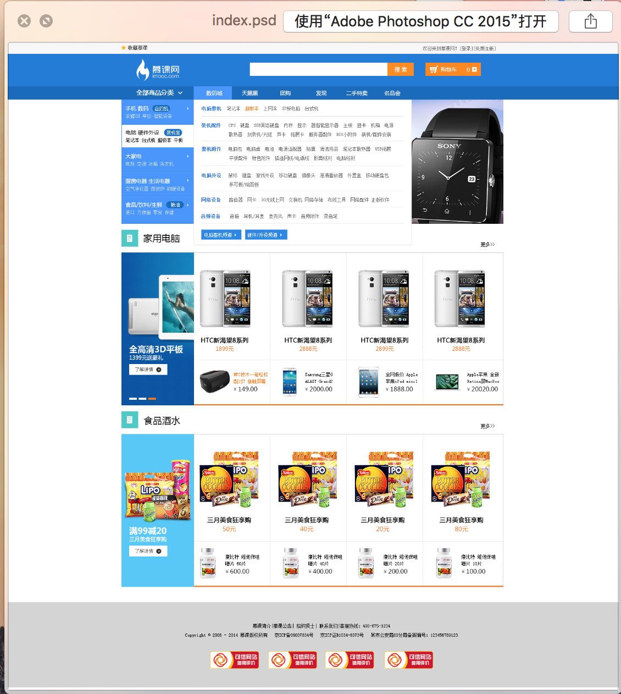
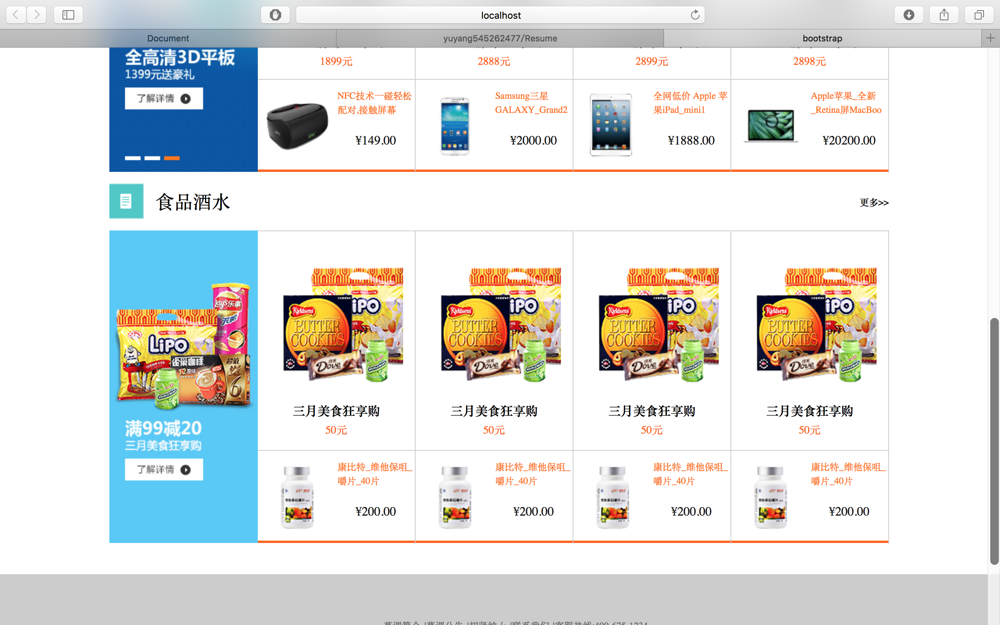

#此仓库用于存放面试参考作品

#项目三 列车时刻查询表

#技术点：

## 1. jQueryMobile 外层框架的基础应用
## 2. Ajax与公共数据服务器进行交互，运用CORS(跨域资源共享)技术解决前端跨域问题

## 项目搭建方式

## yeoman+bower+gulp

# 如何进行项目查看

## 1. 下载项目包
## 2. 将终端路径 选择为下载后项目包的位置

	输入:gulp serve

## 3. 将下列ip地址输入手机浏览器

## 4. 即可看到该项目的效果图

# 最后说点什么
## 该项目虽然并没有做完，但是Mobile框架以及Ajax跨域请求，核心技术，已经完成。

#项目二 基础的电商首页

##构建方式:yeoman+bower+gulp

##知识点:
    1.photoshop切图技术
    2.复杂的页面构建
    3.复杂的css样式构建
    4.像素极还原psd样板图
##psd原图

## 效果图

##对象一 基础的电商demo
##效果图

### 知识点
    1.基础的页面搭建 html构架
    2.基础的样式增势 css 使用
    3.jQuery的日常使用。

>如何获取屏幕高度
    (function($){
        $(document).ready(function(){
            $(window).scrollTop(function(){
                var screenHeight = $(document).scrollTop();
            })
        })
    }(jQuery);

>如何获取元素偏移量

     (function($){
        $(document).ready(function(){
            $(window).scrollTop(function(){
                var ElementOffSet = $('div').offset().top;
            })
        })
    }(jQuery);

>使用jQuery基础的dom操作。

    增:addClass 删:removeClass 改:attr('element','value') 查:attr('element')。

