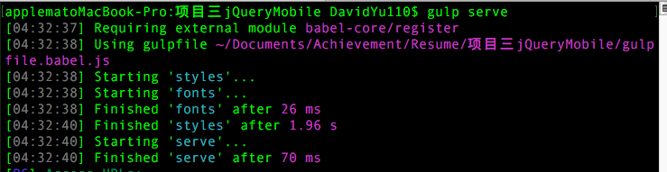
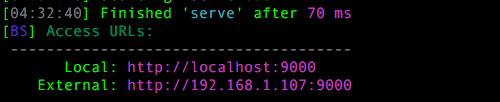

#项目三 列车时刻查询表

#技术点：

## jQueryMobile 外层框架的基础应用
## Ajax与公共数据服务器进行交互，运用CORS(跨域资源共享)技术解决前端跨域问题

## 项目搭建方式

## yeoman+bower+gulp

# 如何进行项目查看

## 1. 下载项目包
## 2. 将终端路径 选择为下载后项目包的位置

	输入:gulp serve

## 3. 将下列ip地址输入手机浏览器

## 4. 即可看到该项目的效果图

# 最后说点什么
## 该项目虽然并没有做完，但是Mobile框架以及Ajax跨域请求，核心技术，已经完成。